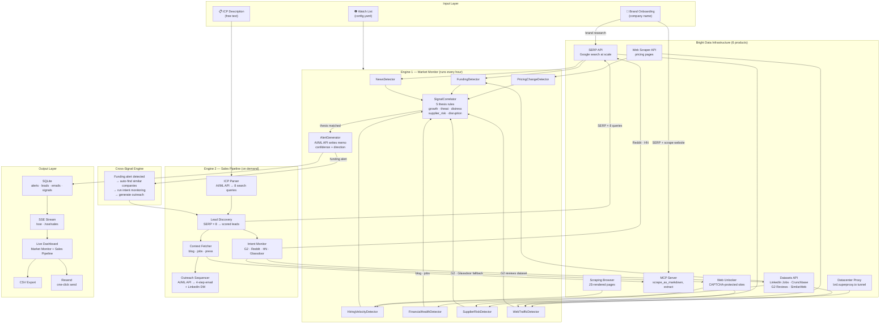

# AlphaSignal

**Autonomous market intelligence and B2B sales engine.** AlphaSignal watches competitors, detects buying signals, and generates personalized outreach — continuously, without human input.

[](https://alphasignal-86xn.onrender.com)
[](https://python.org)
[](https://brightdata.com)

---

## The Problem It Solves

Sales teams spend 60–80% of their time on research that goes stale within days. A company that raised funding yesterday, posted three SDR roles this morning, and has frustrated customers posting on G2 right now is a near-perfect sales target — but by the time a human connects those dots, the window is gone.

AlphaSignal connects those dots in real time.

---

## How It Actually Works

There are three layers of original logic between a raw web page and a structured sales alert:

### Layer 1 — Signal Detection (7 parallel detectors)

Every hour, AlphaSignal runs seven independent detectors against each company in the watch list. Each detector uses a different Bright Data product because each target site has different protection mechanisms:

| Detector | Data Source | What It Reads | Bright Data Product |
|---|---|---|---|
| `HiringVelocityDetector` | LinkedIn Jobs | Open roles, hiring rate, layoff patterns | **Datasets API** (LinkedIn Jobs) → Scraping Browser fallback |
| `PricingChangeDetector` | Pricing pages | Price changes vs. last cached baseline | Web Scraper API |
| `FundingDetector` | Crunchbase | Round size, stage, lead investors | **Datasets API** (Crunchbase Orgs) → SERP API fallback |
| `NewsDetector` | Google News | Acquisitions, launches, exec departures | SERP API |
| `FinancialHealthDetector` | SEC EDGAR | 10-Q filings, cash burn (public companies) | Web Unlocker (CAPTCHA) |
| `SupplierRiskDetector` | Trade databases, forums | Supply chain disruption signals | SERP API + Web Unlocker |
| `WebTrafficDetector` | SimilarWeb | Traffic growth/decline trends | **Datasets API** (SimilarWeb) → Datacenter Proxy → Web Scraper fallback |

Each detector returns a normalized signal object: `{type, company, value, delta, confidence, raw_evidence}`.

### Layer 2 — Signal Correlation (5 thesis rules)

Raw signals are useless in isolation. A company posting 20 jobs could be growing or backfilling after mass layoffs. AlphaSignal's `signal_correlator.py` runs five cross-signal thesis rules:

```
growth_thesis        = funding_detected AND hiring_velocity > +50% AND news_positive
competitive_threat   = competitor_pricing_dropped AND their_hiring_accelerated
financial_distress   = sec_filing_negative AND hiring_freeze AND traffic_declining
supplier_risk        = supply_disruption AND pricing_change_imminent
market_disruption    = news_score < -0.6 AND traffic_delta < -30%
```

A single matched thesis fires an alert. Two matched theses in the same cycle trigger a cross-signal alert with elevated confidence.

### Layer 3 — Alert Generation (AI/ML API)

Only confirmed thesis matches reach the AI/ML API. The prompt includes: the matched thesis pattern, all supporting signal values, historical context, and the specific evidence URLs. The model's job is not to decide whether something is significant — the correlation engine already did that. It writes the investment narrative in the style of a hedge fund research memo: what happened, why it matters, what the likely move is, and what to watch next.

This separation between detection logic and narrative generation is why alerts don't hallucinate. If the data doesn't trigger a thesis, no alert is generated.

---

## Engine 1 — Market Intelligence Monitor

Watches a configurable list of companies continuously. Alerts appear in the live feed as they're generated.

**What a real alert contains:**
- Which thesis was triggered and which signals fired it
- Confidence score (weighted by signal count and evidence quality)
- Investment direction: LONG / SHORT / WATCH / AVOID
- Specific evidence: job posting URLs, pricing page diffs, filing sections
- Recommended action and follow-up signal to watch

**Demo alert example (Growth Thesis — Coda):**
```
Coda hired 23 engineers in 30 days (+180% velocity). TechCrunch confirmed $80M Series D.
G2 reviews show 12 mentions of "switching from Notion" in the last 14 days.
Thesis: Aggressive expansion entering Notion's core market.
Direction: WATCH. Signal to confirm: pricing page change within 60 days.
Confidence: 87%
```

---

## Engine 2 — B2B Sales Pipeline

On-demand discovery and outreach for any ICP description.

**Step-by-step flow:**

```
1. ICP Parsing
   Input: "B2B SaaS, Series A, hiring SDRs, India/US"
   Output: 8 structured Google search queries targeting that exact profile

2. Lead Discovery
   Each query runs through Bright Data SERP API
   Results are de-duplicated, company pages are scraped
   AI/ML API scores each company 0–100 against the ICP

3. Intent Monitoring
   For each scored lead (score ≥ 60):
   - G2 reviews from Datasets API (pre-built, structured) → buying intent signals
   - G2 reviews via Web Unlocker (fallback, live scrape)
   - Reddit/HN mentions scraped → frustration signals with existing tools
   - Glassdoor job postings → budget/team signals

4. Context Fetching
   Company blog, recent press releases, job descriptions scraped via MCP Server
   → feeds into email personalization

5. Outreach Generation
   AI/ML API writes a 4-step sequence using:
   - Your exact brand name, product, use case
   - Lead's specific signals ("saw you're hiring 3 SDRs", "noticed your G2 reviews mention X")
   - Competitor positioning if a competitor was specified
   Each lead also gets a LinkedIn DM variant, subject line, and send timing guidance
```

**What makes the outreach non-generic:** every email references a specific signal pulled from that company's live data. The system does not generate emails from a template — it generates emails from evidence.

---

## Cross-Signal Engine

When Engine 1 fires a funded companies alert, Engine 2 doesn't wait to be asked. It automatically:

1. Extracts the funded company's profile
2. Searches for 10 companies with similar characteristics (same stage, same sector, same hiring patterns)
3. Runs intent monitoring on all of them
4. Generates outreach for anyone showing buying signals

The reasoning: a company that just raised is in buying mode. Similar companies in the same stage are statistically likely to be in the same cycle. This is the logic that makes AlphaSignal useful as an outbound tool rather than just a research dashboard.

---

## Why Each Bright Data Product

This isn't "use whichever API is cheapest." Each product is chosen because other approaches fail on that specific target — and the six products form a priority stack, not independent integrations.

**Datasets API** — the highest-priority path for structured data. Bright Data maintains pre-built, continuously refreshed datasets for LinkedIn Job Postings, Crunchbase Organizations, G2 Reviews, and SimilarWeb traffic. AlphaSignal queries these first via `POST /datasets/v3/trigger` → poll → `GET /datasets/v3/download`. Structured JSON, no parsing, highest confidence scores. Used by `HiringVelocityDetector`, `FundingDetector`, `WebTrafficDetector`, and `IntentMonitor`.

**Datacenter Proxy** — routes outbound HTTP requests through `brd.superproxy.io` using a real proxy tunnel (not an API endpoint wrapper). Used specifically for SimilarWeb when the Datasets API returns nothing — SimilarWeb aggressively blocks cloud provider IPs (AWS, GCP, Render). The proxy exits from a Bright Data datacenter IP, bypassing the block entirely. Wired via `aiohttp`'s native proxy support in `proxy_fetch()`.

**MCP Server** — primary live-scrape path via JSON-RPC 2.0 session protocol. `scrape_as_markdown` returns clean text directly usable as model context without HTML parsing. Used for company blogs, job descriptions, LinkedIn profiles, and brand research. Session is initialized once and reused across all calls.

**SERP API** — used for discovery and news at scale. Lead discovery runs 8 parallel Google queries per pipeline execution. Raw Google scraping at this frequency gets rate-limited in minutes. SERP API returns stable, structured `{organic: [...]}` JSON. Also used for funding news, competitor mentions, and Reddit/HN intent signals.

**Web Scraper API** — used for pricing pages. The key property is repeatability: AlphaSignal caches a baseline on first scrape and diffs it on every subsequent run. A 10% drop on a competitor's enterprise tier is a high-confidence signal. The Scraper API handles rotating IPs so the same pricing page can be hit reliably every hour.

**Web Unlocker** — fallback for CAPTCHA-protected and geo-blocked sites: G2 (bot detection), Glassdoor (geolocation headers required), SEC EDGAR (blocks non-US IPs). These three have different protection models — Web Unlocker handles all three through a single endpoint.

---

## Architecture



### Data flow summary

```
Brand name
  └─ SERP API + MCP scrape → company profile (competitors, ICP, stage)
       └─ populates config.yaml watch list

Every hour (Market Monitor):
  watch list companies
    └─ 7 detectors run in parallel
         ├─ HiringVelocity  → Datasets API (LinkedIn Jobs) → Scraping Browser fallback
         ├─ PricingChange   → Web Scraper API (baseline diff)
         ├─ Funding         → Datasets API (Crunchbase Orgs) → SERP API fallback
         ├─ News            → SERP API (Google News)
         ├─ FinancialHealth → Web Unlocker (SEC EDGAR)
         ├─ SupplierRisk    → SERP API + Web Unlocker
         └─ WebTraffic      → Datasets API (SimilarWeb) → Datacenter Proxy → Web Scraper fallback
              └─ normalized signals: {type, value, delta, confidence, evidence_url}
                   └─ SignalCorrelator: test 5 cross-signal thesis patterns
                        └─ thesis match → AI/ML API writes investment alert
                             └─ SSE stream → dashboard + SQLite

On demand (Sales Pipeline):
  ICP text
    └─ AI/ML API → 8 targeted Google queries
         └─ SERP API → company candidates (de-duped)
              └─ AI/ML API scores each 0–100 vs ICP
                   └─ score ≥ 60 → intent monitoring
                        ├─ G2 reviews: Datasets API → Web Unlocker fallback
                        ├─ Reddit/HN: SERP API
                        └─ Glassdoor: Web Unlocker
                             └─ context fetch (blog/jobs via MCP Server)
                                  └─ AI/ML API → 4-step email + LinkedIn DM
                                       └─ SSE stream → lead appears in dashboard

Cross-signal (automatic):
  funding alert fired
    └─ find 10 similar companies (same stage + sector)
         └─ run full intent + outreach pipeline on all of them
```

---

## Setup

### Prerequisites
- Python 3.11+
- [Bright Data account](https://brightdata.com) — free trial available
- [AI/ML API key](https://aimlapi.com) or Anthropic API key
- [Resend](https://resend.com) account for email sending (optional)

### Install and run

```bash
git clone https://github.com/RagavRida/alphasignal
cd alphasignal
pip install -r requirements.txt
cp .env.example .env   # fill in your keys
python main.py
```

Dashboard: `http://localhost:8080`

### Demo mode (no credentials needed)

```bash
python main.py --demo
```

Opens the dashboard with pre-loaded demo data for a Notion competitor analysis. Click **🎬 Demo** in the Sales tab to load 8 pre-curated leads with full email sequences.

### Environment variables

```bash
# Required for live mode
BRIGHT_DATA_API_TOKEN=       # Bright Data REST API token (used by all products)
BRIGHT_DATA_SERP_ZONE=       # SERP API zone name (from Bright Data dashboard)
BRIGHT_DATA_SCRAPER_ZONE=    # Web Scraper zone name
BRIGHT_DATA_MCP_URL=         # MCP server URL with token
BRIGHT_DATA_PROXY_HOST=      # Datacenter proxy host (brd.superproxy.io)
BRIGHT_DATA_PROXY_PORT=      # Proxy port (33335)
BRIGHT_DATA_PROXY_USER=      # Proxy username (brd-customer-xxx-zone-yyy)
BRIGHT_DATA_PROXY_PASS=      # Proxy password
AIML_API_KEY=                # AI/ML API key (model served via OpenAI-compatible endpoint)

# Optional
RESEND_API_KEY=              # For email sending from the dashboard
SLACK_WEBHOOK_URL=           # For Slack alert notifications
DEMO_MODE=false              # Set true to skip all API calls
```

---

## Project Structure

```
alphasignal/
├── src/
│   ├── bright_data_client.py   # Unified async Bright Data client (all 6 products)
│   ├── signal_detectors.py     # 7 parallel detectors
│   ├── signal_correlator.py    # Cross-signal thesis engine (5 rules)
│   ├── alert_generator.py      # AI/ML API alert narration
│   ├── monitor.py              # Autonomous monitor loop
│   ├── state.py                # SQLite persistence
│   ├── company_profile.py      # Brand intelligence + watch list generation
│   ├── llm.py                  # Lightweight AIML/OpenAI-compatible HTTP client
│   └── sales/
│       ├── icp_parser.py       # Free-text ICP → structured search queries
│       ├── lead_discovery.py   # SERP → scored leads
│       ├── intent_monitor.py   # G2/Reddit/HN buying signals
│       ├── context_fetcher.py  # Blog/jobs scraping for email personalization
│       ├── competitive_radar.py# Competitor pricing + sentiment
│       ├── outreach_sequencer.py# 4-step email + LinkedIn DM generation
│       ├── pipeline.py         # Full pipeline orchestrator
│       └── sales_state.py      # SQLite for leads, emails, signals
├── src/dashboard/
│   ├── server.py               # FastAPI server + SSE endpoints
│   └── static/                 # Dashboard UI (market monitor + sales pipeline)
├── main.py                     # Entry point
├── config.yaml                 # Watch list + thresholds
└── requirements.txt
```

---

## Signal Thresholds

These are configurable in `config.yaml`:

| Signal | Default Threshold | What It Means |
|---|---|---|
| `hiring_velocity_alert` | +50% | Month-over-month open role increase |
| `hiring_freeze_threshold` | 90% drop | Month-over-month open role decrease |
| `pricing_change_alert` | 10% | Absolute price change on any plan |
| `traffic_growth_alert` | +30% | Month-over-month traffic increase |
| `funding_min_amount_m` | $10M | Minimum funding round to trigger |
| `minimum_confidence` | 65% | Minimum signal confidence to surface |
| `correlation_match_score` | 0.6 | Minimum thesis match to generate alert |

---

## Built With

- **[Bright Data](https://brightdata.com)** — web data infrastructure (Datasets API, MCP Server, SERP API, Web Scraper API, Scraping Browser, Web Unlocker, Datacenter Proxy)
- **[AI/ML API](https://aimlapi.com)** — model served via OpenAI-compatible endpoint
- **[FastAPI](https://fastapi.tiangolo.com)** — async Python web framework
- **[Resend](https://resend.com)** — transactional email

---

*Built for the Bright Data Hackathon 2026.*
